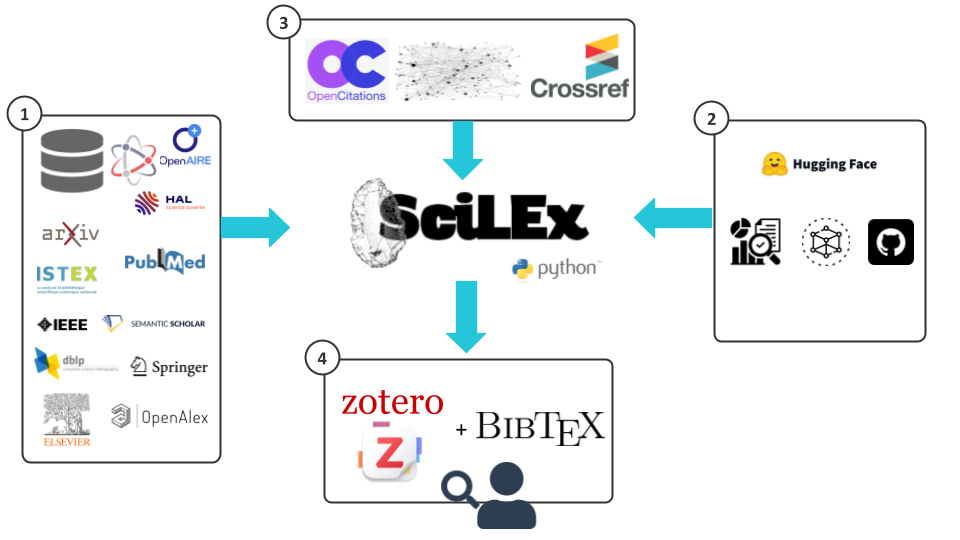

<div align="center">
<br>


</div>

<p align="center">
    <em>Systematic literature search across 12 academic APIs</em>
</p>

<p align="center">
    
    
    
    
</p>

<p align="center">
    <a href="https://scilex.readthedocs.io/en/latest/">
    
    </a>
    
</p>

---
> SciLEx — like the silex stone that early humans relied on to spark fire from raw material — is a lightweight, portable tool designed to ignite research exploration. Rather than navigating fragmented databases, confronting redundant results, and manually sifting through noise, SciLEx strikes directly at the core challenge: it queries heterogeneous digital library APIs, applies smart deduplication and quality filtering, and delivers a clean, curated corpus ready for export to Zotero or BibTeX. It is not a full-scale review platform — it is the essential flint in the researcher's toolkit, engineered to quick-start systematic literature reviews with precision and minimal friction.

## Table of Contents

- [Overview](#overview)
- [Architecture](#architecture)
- [Key Features](#key-features)
- [Project Structure](#project-structure)
- [Getting Started](#getting-started)
- [Citation](#citation)
- [Contributing](#contributing)
- [License](#license)

---

## Overview

**SciLEx** (Science Literature Exploration) is a Python toolkit for systematic literature reviews. It crawls 12 academic APIs in parallel, deduplicates results using DOI-based and normalized title exact matching, and applies a 5-phase quality filtering pipeline before exporting to Zotero or BibTeX.


---

## Architecture



---

## Key Features

- Multi-API collection with parallel processing (12 academic APIs)
- Smart deduplication using DOI and normalized title matching
- 5-phase quality filtering pipeline with time-aware citation thresholds:
  1. **ItemType Filter** — whitelist by publication type (journal, conference, etc.)
  2. **Quality Filter** — require DOI, abstract, year, minimum author count, optional open-access
  3. **Abstract Quality Filter** — remove placeholder or low-quality abstracts
  4. **Citation Filter** — time-aware thresholds (e.g. ≥1 citation after 18 months, ≥10 after 3 years)
  5. **Relevance Ranking** — composite score (0–10) from keyword density, metadata completeness, venue type, and citation impact
- Citation count enrichment via CrossRef, OpenCitations, and Semantic Scholar
- HuggingFace enrichment: query HuggingFace Hub to retrieve associated ML models, datasets, and GitHub repositories
- Export to Zotero (bulk upload) or BibTeX (with PDF links)
- Idempotent collections for safe re-runs

### Supported APIs

| API | Key Required | Coverage | Best For |
|-----|-------------|----------|----------|
| **SemanticScholar** | Optional | 200M+ papers | CS/AI papers, citation networks |
| **OpenAlex** | Optional | 250M+ works | Broad coverage, ORCID data |
| **IEEE** | Yes | 5M+ docs | Engineering, CS conferences |
| **Arxiv** | No | 2M+ preprints | Preprints, physics, CS |
| **Springer** | Yes | 13M+ docs | Journals, books |
| **Elsevier** | Yes | 18M+ articles | Medical, life sciences |
| **PubMed** | Optional | 35M+ papers | Biomedical literature |
| **HAL** | No | 1M+ docs | French research, theses |
| **DBLP** | No | 6M+ CS papers | CS bibliography, 95%+ DOI |
| **Istex** | No | 25M+ docs | French institutional access |
| **OpenAIRE** | No | 200M+ docs | Open-access, EU research |
| **ORKG** | No | 55K papers | Structured CS research comparisons |

See the [API Comparison](https://scilex.readthedocs.io/en/latest/reference/api-comparison.html) for rate limits, coverage details, and limitations.

---

## Project Structure

```sh
└── SciLEx/
    ├── README.md
    ├── pyproject.toml
    ├── CONTRIBUTING.md
    ├── .env.example
    ├── scilex/
    │   ├── run_collection.py
    │   ├── aggregate_collect.py
    │   ├── enrich_with_hf.py
    │   ├── push_to_zotero.py
    │   ├── export_to_bibtex.py
    │   ├── quality_validation.py
    │   ├── keyword_validation.py
    │   ├── abstract_validation.py
    │   ├── duplicate_tracking.py
    │   ├── crawlers/
    │   ├── citations/
    │   ├── Zotero/
    │   ├── HuggingFace/
    │   └── tagging/
    ├── tests/
    ├── docs/
    └── img/
```

---

## Getting Started

### Prerequisites

- 
- [uv](https://docs.astral.sh/uv/) (recommended) or pip

### Installation

1. Clone the repository:

```sh
❯ git clone https://github.com/Wimmics/SciLEx
```

2. Navigate to the project directory:

```sh
❯ cd SciLEx
```

3. Install dependencies:

**Using `uv`** &nbsp; []

```sh
❯ uv sync
```

**Using `pip`:**

```sh
❯ pip install -e .

# With dev dependencies (pytest, ruff, coverage)
❯ pip install -e ".[dev]"
```

### Configuration

Copy the example config files and fill in your API keys:

```sh
❯ cp scilex/api.config.yml.example scilex/api.config.yml
❯ cp scilex/scilex.config.yml.example scilex/scilex.config.yml
❯ cp scilex/scilex.advanced.yml.example scilex/scilex.advanced.yml
```

See the [Configuration Guide](https://scilex.readthedocs.io/en/latest/getting-started/configuration.html) for all available settings.

### Usage

**Option A — with environment activation:**
```sh
❯ source .venv/bin/activate       # macOS/Linux
❯ .venv\Scripts\activate          # Windows
❯ scilex-collect
```

**Option B — with `uv run` (no activation needed):**
```sh
❯ uv run scilex-collect
```

Run the pipeline step by step:

```sh
# 1. Collect papers from all configured APIs
❯ scilex-collect

# 2. Deduplicate and apply quality filtering
❯ scilex-aggregate

# 3. (Optional) Enrich with HuggingFace metadata
❯ scilex-enrich

# 4. Export results
❯ scilex-push-zotero        # Push to a Zotero collection
❯ scilex-export-bibtex      # Export to BibTeX
```

See the [Quick Start Guide](https://scilex.readthedocs.io/en/latest/getting-started/quick-start.html) for a complete walkthrough.

### Testing

Install dev dependencies first (not included in the default install):

```sh
❯ uv sync --extra dev
```

Then run the tests:

```sh
❯ uv run python -m pytest tests/ -v                                              # All tests
❯ uv run python -m pytest tests/ --cov=scilex --cov-report=term-missing         # With coverage
❯ uv run python -m pytest tests/ -v -m "not live"                               # Offline tests only
```

---

## Citation

If you use SciLEx in your research, please cite:

**Full text:**

Célian Ringwald, Benjamin Navet. SciLEx, Science Literature Exploration Toolkit ⟨swh:1:dir:944639eb0260a034a5cbf8766d5ee9b74ca85330⟩.

**BibTeX:**

```bibtex
@softwareversion{scilex2026,
  TITLE = {{SciLEx, Science Literature Exploration Toolkit}},
  AUTHOR = {Ringwald, Célian and Navet, Benjamin},
  URL = {https://github.com/Wimmics/SciLEx},
  NOTE = {},
  INSTITUTION = {{University Côte d'Azur ; CNRS ; Inria}},
  YEAR = {2026},
  MONTH = Fev,
  SWHID = {swh:1:dir:944639eb0260a034a5cbf8766d5ee9b74ca85330},
  VERSION = {1.0},
  REPOSITORY = {https://github.com/Wimmics/SciLEx},
  LICENSE = {MIT Licence},
  KEYWORDS = {Python, Scientific literature, literature research, paper retrieval},
  HAL_ID = {},
  HAL_VERSION = {},
}
```

---

## Contributing

- Report issues: [GitHub Issues](https://github.com/Wimmics/SciLEx/issues)
- See [CONTRIBUTING.md](CONTRIBUTING.md) for development guidelines

<p align="center">
   <a href="https://github.com/Wimmics/SciLEx/graphs/contributors">
      
   </a>
</p>

---

## License

This project is protected under the [MIT](LICENSE) License. For more details, refer to the [LICENSE](LICENSE) file.

---

<p align="center">
   <a href="#top">Return to top</a>
</p>
