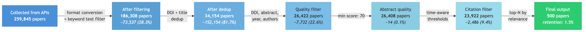

  

# A Spark for Systematic Literature Reviews

SciLEx — much like the silex stone that early humans relied on to spark fire from raw material — is a lightweight, portable tool designed to ignite research exploration. Rather than navigating fragmented databases, confronting redundant results, and manually sifting through noise, SciLEx strikes directly at the core challenge: it queries heterogeneous digital library APIs, applies smart deduplication and quality filtering, and delivers a clean, curated corpus ready for export to Zotero or BibTeX. It is not a full-scale review platform — it is the essential flint in the researcher's toolkit, engineered to quick-start systematic literature reviews with precision and minimal friction.

# Detailed Summary
[SciLEx (Science Literature Exploration)](https://github.com/Wimmics/SciLEx) is an open-source Python toolkit designed to support systematic literature reviews in research and academic contexts. Users define one or two groups of keywords: within each group, terms are combined with Boolean OR logic, while the two groups are combined with AND, enabling precise compound queries without manual query construction. 
SciLEx concurrently queries up to 12 academic APIs — Semantic Scholar, OpenAlex, IEEE, ArXiv, Springer, Elsevier, HAL, DBLP, ORKG, OpenAIRE, Istex, and PubMed — and deduplicates results, so that papers retrieved from multiple APIs are merged rather than counted multiple times. Collected papers then pass through a configurable multi-stage filtering pipeline that scores metadata completeness, enforces time-aware citation thresholds, and ranks results by a composite relevance score, distilling potentially hundreds of thousands of raw results into a curated final set.
SciLEx further extracts citation networks using multiple sources: Semantic Scholar/OpenAlex/CrossRef and OpenCitations[@peroni_opencitations_2020]. It can also enrich the collection of papers using Hugging Face metadata — linked models, datasets, topic keywords and GitHub repository — making it particularly suited to AI and machine learning literature reviews. Final outputs can be exported to BibTeX or pushed directly to a Zotero[@mueen_ahmed_zotero_2011] collection. All operations are idempotent: interrupted or repeated runs automatically resume from where they left off, making SciLEx practical on standard personal hardware.

# Statement of need

The volume of scientific publications has grown dramatically in recent years[@10.1162/qss_a_00327], making comprehensive literature surveys increasingly difficult to conduct manually. Researchers initiating a new project or conducting a systematic review[@kitchenham2007guidelines] must navigate a fragmented landscape of disciplinary databases with incompatible formats, heterogeneous metadata standards, and varying access policies. Existing reference managers such as Zotero provide manual search interfaces and import functionality, but do not automate multi-API retrieval, cross-source deduplication, or quality-based filtering. 

SciLEx fills this gap by providing a fully automated, configurable, and locally executable pipeline that takes keyword inputs and produces a ranked, deduplicated, and enriched bibliography — requiring no subscription and no cloud dependency. It is designed for researchers and graduate students who need to efficiently scope a new research area.

SciLEx enriches the extracted papers with many other open services, extracting citation networks using multiple sources: Semantic Scholar/OpenAlex/CrossRef[@hendricks_crossref_2020] and OpenCitations[@peroni_opencitations_2020]. It also integrates Hugging Face metadata — linked models, datasets, topic keywords, and GitHub repositories — which deliver a first layer of context to start a bibliographic analysis. 

Finally, SciLEx exports all gathered information into a Zotero collection, facilitating collaborative management, selection, and annotation of the corpus.

### Key Features

SciLEx is built around the following core capabilities, each thoroughly documented in our [readthedocs.io](https://scilex.readthedocs.io/en/latest/):

* Multi-source collection. Papers are retrieved concurrently from up to 12 academic APIs — Semantic Scholar, OpenAlex, IEEE, ArXiv, Springer, Elsevier, HAL, DBLP, ORKG, OpenAIRE, Istex, and PubMed — using parallel processing to minimise collection time.
* Flexible query construction. Users can either supply a flat list of keywords, generating one query per keyword, or define two keyword groups whose terms are combined pairwise — implicitly encoding both OR logic (within groups) and AND logic (across groups) — without writing raw query strings.
* Cross-source deduplication. Results are deduplicated across APIs using DOI matching, URL matching, and normalized exact title matching, ensuring that papers retrieved from multiple sources are merged into a single record.
* Citation network extraction. SciLEx retrieves citation and reference lists via OpenCitations and Semantic Scholar, with results cached locally in SQLite to avoid redundant API calls across runs. This enables both impact-based filtering and citation snowballing.
* Multi-stage quality filtering. Collected papers pass through a configurable pipeline that enforces time-aware citation thresholds, filters by item type, and ranks results by a composite relevance score computed from keyword matches and optional bonus keywords.
* Hugging Face enrichment. For machine learning literature, SciLEx can enrich each paper with linked models, datasets, GitHub statistics, and AI-specific keywords sourced from Hugging Face.
* Zotero integration. The full enriched corpus can be uploaded directly to a Zotero collection in batches, supporting collaborative annotation and selection.
* Idempotent execution. All operations are safe to interrupt and re-run: completed queries are automatically detected and skipped, making SciLEx practical on standard personal hardware without dedicated infrastructure.
* BibTeX export. The final curated bibliography can be exported as a BibTeX file for direct use in LaTeX-based workflows.

# Software design

SciLEx is implemented in Python and follows a modular, pipeline-oriented architecture organised around nine core components. The overall data flow proceeds in two phases: a parallel collection phase that queries APIs concurrently and stores raw results as JSON, followed by an aggregation phase that converts, deduplicates, filters, and ranks papers before exporting them.

API Collection → Deduplication → Item Type Filter → Keyword Filter → Quality Filter → Citation Filter → Relevance Ranking → Output

**Collection system**. The collection layer (scilex/crawlers/collector_collection.py) orchestrates parallel API querying using one thread per API. It generates jobs from the user configuration as combinations of keywords, years, and target APIs, then tracks progress and skips already-completed queries, making all runs idempotent. Each of the 12 supported APIs has a dedicated collector class in scilex/crawlers/collectors/, all inheriting from a shared abstract base class API_collector (base.py) that defines a uniform interface for query construction, pagination, and result parsing. Adding a new API requires only implementing this interface and registering the collector — no other components need to be modified.

**Format conversion**. Raw JSON responses from each API are converted into a unified, Zotero-compatible internal schema by a dedicated converter in scilex/crawlers/aggregate.py. 

**Aggregation and filtering pipeline**. The aggregation pipeline (scilex/aggregate_collect.py) loads all collected JSON files, applies format conversion and deduplication — merging records by DOI, URL, or normalized exact title match — and then passes papers through a five-phase filtering engine: item type filtering, keyword relevance filtering (scilex/keyword_validation.py), metadata quality scoring (scilex/quality_validation.py), time-aware citation thresholds, and final relevance ranking. A parallel aggregation mode (scilex/crawlers/aggregate_parallel.py) is also available for large corpora, using multiprocessing with batches of 5,000 papers and automatic CPU count detection. An illustrative example of this pipeline applied to a real collection run — showing paper counts at each stage — is provided in [Appendix A](#appendix-a).

**Citation system**. Citation and reference data are retrieved via a four-tier strategy: a local SQLite cache (output/citation_cache.db) is consulted first; if unavailable, Semantic Scholar in-memory data, CrossRef live API calls, and finally OpenCitations are tried in sequence. This tiered approach minimises redundant network requests while maximising coverage.

**Hugging Face enrichment**. A modular enrichment subsystem (scilex/HuggingFace/) links papers to Hugging Face metadata — associated models, datasets, tasks, and GitHub statistics — using fuzzy title matching. It is invoked via scilex/enrich_with_hf.py, either from the command line or programmatically.

**Zotero integration**. The Zotero API client (scilex/Zotero/zotero_api.py) uploads the enriched corpus in batches of 50 items, with duplicate detection by URL and collection management support.

**Configuration**. SciLEx uses a hierarchical configuration system with six priority levels: built-in defaults (scilex/config_defaults.py), a main configuration file (scilex.config.yml), an optional advanced configuration file (scilex.advanced.yml) that merges and overrides the main config, an API credentials file (api.config.yml), environment variables, and command-line arguments. This layered design allows users to start with sensible defaults and incrementally customise behaviour without editing source code.

**Resilience and performance**. API reliability is managed via a circuit breaker pattern (scilex/crawlers/circuit_breaker.py) that tracks consecutive failures per API, opens the circuit after five failures, and auto-retries after a 60-second timeout. All API calls enforce a 30-second timeout with exponential backoff retry logic. Per-API rate limiting uses a dual-value system supporting both authenticated and unauthenticated request rates.

**Interfaces**. SciLEx can be used in two ways. From the command line, the main pipeline steps are invoked as individual scripts — run_collection.py for collection, aggregate_collect.py for aggregation and filtering, enrich_with_hf.py for Hugging Face enrichment, export_to_bibtex.py for BibTeX export, and push_to_zotero.py for Zotero upload — making it straightforward to integrate SciLEx into shell-based or automated workflows.

Programmatically, all components are importable as a Python library: the CollectCollection class orchestrates collection directly from a Python dictionary config, removing the need for YAML files entirely, while aggregation and enrichment steps are invoked by calling their respective main() functions. This dual interface makes SciLEx suitable both for one-off interactive use in Jupyter notebooks and for embedding in larger, reproducible research pipelines. A full end-to-end example covering configuration, collection, aggregation, enrichment, and export is provided in the project documentation.

# Research use / scholarly publications enabled

SciLEx was originally developed to support a systematic literature review conducted during a PhD on pattern-based information extraction from natural language and knowledge graphs, presented at AAAI-24 [@Ringwald_2024]. The tool has since been generalised and extended to support literature reviews across a broader range of research areas, particularly in AI and machine learning, where the need to survey rapidly growing bodies of preprint and conference literature across heterogeneous sources is especially acute. SciLEx is designed for researchers and graduate students who need to scope a new research area, assemble a reproducible corpus, or conduct a formal systematic review — and has been used in this capacity within the Wimmics research groups. The first systematic literature review based on SciLEx [@celian2025systematicreviewrelationextraction] is currently under review.

# Comparison with existing software

**1. CoLRev (2024)**

CoLRev [@wagner2024colrev] is a comprehensive open-source environment for collaborative literature reviews that covers the full review lifecycle: problem formulation, search, deduplication, screening, PDF retrieval and preparation, and synthesis. It is built around Git-based collaboration and shared data standards, making it well suited for large, multi-reviewer systematic reviews that require auditability and reproducibility across teams. Compared to SciLEx, CoLRev is considerably broader in scope, addressing stages well beyond corpus assembly. SciLEx is more narrowly focused on the collection, deduplication, quality filtering, and enrichment phases, and is designed for individual researchers or small teams who need a lightweight, locally executable tool without the overhead of a full review management environment. The two tools are therefore largely complementary: SciLEx could be used to assemble an initial corpus that is then imported into CoLRev for screening and synthesis.

**2. PyPaperRetriever (2025)**

PyPaperRetriever [@Turner2025] is a medically oriented literature exploration tool that takes a set of papers identified by DOI or PubMed ID as input and queries three APIs — Unpaywall, NIH Entrez, and CrossRef — to retrieve related papers by traversing their citation networks. It also supports extraction of full PDF content, making it better suited to text mining workflows than to bibliographic curation. Its API coverage is narrower than SciLEx, it relies on an existing seed set rather than keyword-driven discovery, and its outputs are centred on textual content rather than structured bibliographic metadata. SciLEx and PyPaperRetriever therefore serve complementary purposes: SciLEx is better suited to broad, keyword-driven corpus assembly, while PyPaperRetriever is better adapted to citation-based expansion from a known set of papers.

**3. Pygetpapers (2022)** 

Pygetpapers [@Garg2022] is a biology and medical research oriented tool that collects papers from a simple keyword list by querying arXiv, EuropePMC, bioRxiv, and medRxiv. It does not offer deduplication across sources, nor does it provide filtering strategies to manage the volume of results that can be returned. Its outputs — PDFs and XML files — are oriented toward text mining rather than bibliographic management, and cannot be directly exported to a shared bibliography. SciLEx differs in its broader API coverage, its multi-stage filtering and ranking pipeline, its cross-source deduplication, and its focus on producing structured, exportable bibliographic records.

**4. PyPaperBot (2020)**

PyPaperBot [@pypaperbot], while functional, has significant limitations that prompted the development of PyPaperRetriever. PyPaperBot relies primarily on Sci-Hub, which is ethically controversial, may be unlawful to use in many jurisdictions, and is often blocked by academic institutions and in certain countries. PyPaperBot does not support multi-API collection, cross-source deduplication, or quality filtering, and is oriented toward PDF acquisition rather than systematic bibliographic curation. SciLEx addresses a different need: assembling and curating a structured, deduplicated corpus from legitimate open academic APIs, without reliance on legally contested sources.

**5. ResearchRabbit, Litmaps, and ConnectedPapers**

ResearchRabbit, Litmaps, and ConnectedPapers are web-based citation mapping tools designed for interactive, visual exploration of the literature surrounding one or more seed papers. They are well suited to exploratory discovery — identifying seminal works, following citation chains, and mapping thematic clusters — but are not designed for systematic, reproducible, keyword-driven corpus assembly. They do not support multi-API querying, programmatic access, quality-based filtering, or structured export to reference managers without manual intervention. Furthermore, all three operate as hosted services with usage limits on their free tiers, introducing cloud dependencies and reproducibility constraints that SciLEx avoids by design. SciLEx and these tools are best understood as complementary: the latter can support exploratory scoping of a field, while SciLEx is better suited to the systematic assembly and curation of a reproducible bibliography.

# Development agenda

The use of SciLEx in fast-moving and dynamic research fields may also involve updating and extending an existing literature collection. Our experience in conducting the survey [@celian2025systematicreviewrelationextraction] further highlighted the substantial annotation effort required for a systematic literature review. The collaborative tagging and annotation of the collected corpus—managed and enriched through Zotero—suggest promising extensions of this workflow. In particular, extracted keywords could inform future collection rounds, while annotation could be progressively expanded to the full corpus following the consolidation of annotation guidelines and the implementation of cross-annotation procedures.

Further planned extensions include:

- **Citation chaining and snowball sampling.** Extending the collection phase with forward and backward citation chaining to complement keyword-based discovery and address its inherent vocabulary ceiling.
- **Citation network analysis.** Leveraging the citation and reference data already collected to build citation graphs, detect research community clusters, and identify hub papers — turning raw citation counts into structural bibliometric insights without additional API calls.
- **LLM-augmented pipeline steps.** Introducing optional large language model–based stages: semantic abstract screening to reduce false positives and false negatives inherent to substring keyword matching, and AI-powered keyword expansion to assist users unfamiliar with a field's vocabulary in constructing effective queries.
- **Enrichment extensions.** Adding open access status classification via Unpaywall (gold/green/bronze/closed), author impact metrics (h-index) via the Semantic Scholar Author API.
- **LLM-based pre-annotation** Annotating paper using titles/abstracts (e.g., task, language, and domain) to accelerate downstream manual review. 

# Acknowledgements

This work was supported by the French government through the France 2030 investment plan managed by the National Research Agency (ANR), as part of the Initiative of Excellence Université Côte d'Azur (ANR-15-IDEX-01). Additional support came from the French government's France 2030 investment plan (ANR-22-CPJ2-0048-01), through 3IA Côte d'Azur (ANR-23-IACL-0001).

## AI Usage Disclosure

Tools used: Claude Code CLI (Anthropic) with Claude Sonnet 4.5 and Claude Opus 4.5 models, used from October 2025 through February 2026. Prior to October 2025, no AI tools were used by any contributor (C. Ringwald, F. Gandon).
Scope of assistance: 
  - Code development and refactoring: Claude Code was used to assist with implementing new features (PubMed collector, Hugging Face enrichment pipeline, BibTeX export, parallel aggregation, citation caching), refactoring the collector architecture (modular collector classes, multi-threading migration, state management removal), and bug fixing (API rate limiting, URL encoding, deduplication logic, metadata extraction).
  - Code quality: Automated linting, formatting (via Ruff), and code style improvements.
  - Documentation: Updating README, CLAUDE.md project instructions, documentation suite (docs/) and inline documentation.
 

# References

---

## Appendix A: Filtering Funnel Example {#appendix-a}

The following example illustrates SciLEx's filtering pipeline applied to a real collection run on the topic of relation extraction. Starting from 259,845 raw results collected across 12 APIs, the pipeline progressively reduces the corpus to a curated set of 500 papers — a 1.5% retention rate.

<!--  -->

| Stage | Papers remaining | Removed | Cumulative removal |
|-------|----------------:|---------:|-------------------:|
| Collected from APIs | 259,845 | — | — |
| After format conversion + keyword filter | 186,308 | 73,537 (28.3%) | 28.3% |
| After deduplication | 34,154 | 152,154 (81.7%) | 86.9% |
| After quality filter | 26,422 | 7,732 (22.6%) | 89.8% |
| After abstract quality filter | 26,408 | 14 (0.1%) | 89.8% |
| After citation filter | 23,922 | 2,486 (9.4%) | 90.8% |
| Final output (top-N by relevance) | 500 | 23,422 (97.9%) | 99.8% |
